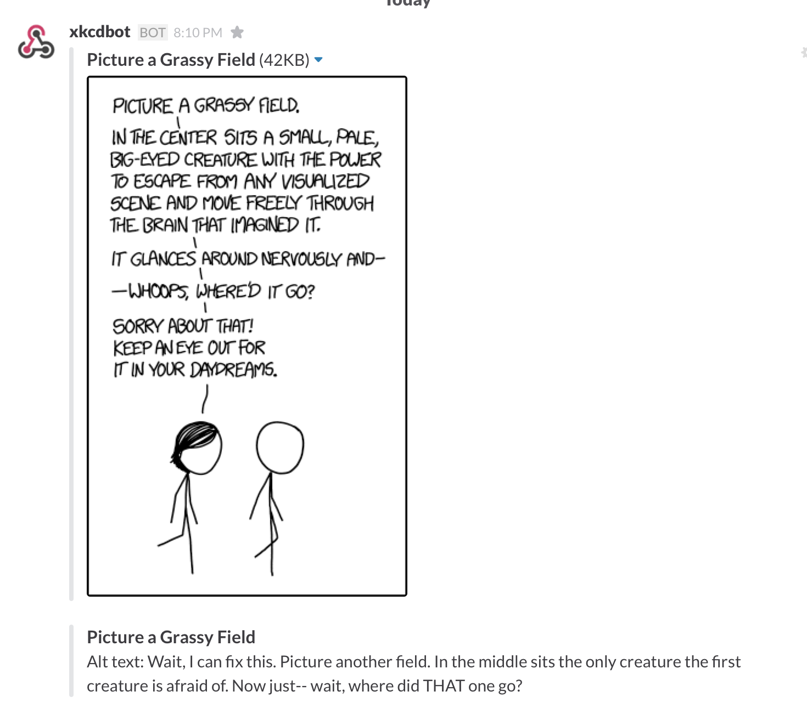

# new-xkcd-slack

So you're chatting in Slack, and there's a new xkcd out. Your RSS reader isn't open, and you haven't looked at [xkcd.com](http://xkcd.com) in a while. With this bot for Slack, don't worry about missing out, as it'll post the latest xkcd to Slack automagically* (*depending on the cron job that you use).

## Installation

1. Download this repository
2. Set the Slack hook URL, bot name and bot image URL in new-xkcd-slack.py
3. Install dependencies using 'pip install -r requirements.txt'
4. Setup a cron job to run the python script (eg. '0 0,4,8,12,16,20 * * * root ./path/to/new-xkcd-slack.py')

## Screenshot

(Note: the comic and alt text is licensed under a Creative Commons Attribution-NonCommercial 2.5 License)

## License

The code is licensed under the MIT license (found in the LICENSE file).